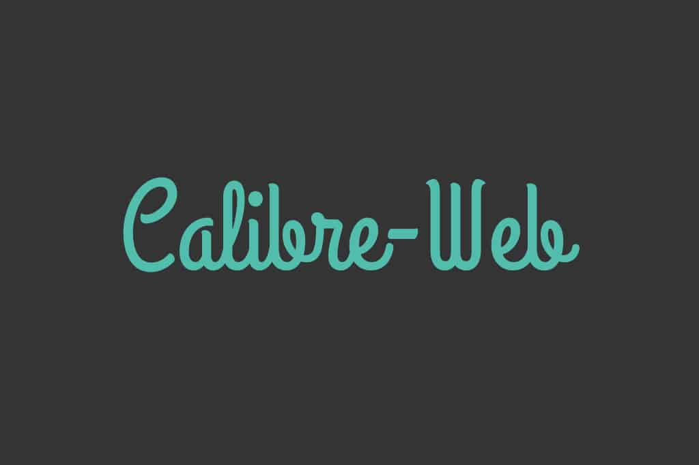

# Calibre Web

 

https://github.com/janeczku/calibre-web

## Summary

Calibre-Web is a web app providing a clean interface for browsing, reading and downloading eBooks using an existing Calibre database.

## Why is this useful for offline or underserved communities?

Communities can use Calibre Web to build and curate eBook libraries. Users can access eBooks through the web interface, or download them to their mobile devices to read at home.

## Basic Info

## Features

- Bootstrap 3 HTML5 interface
- full graphical setup
- User management with fine-grained per-user permissions
- Admin interface
- User Interface in brazilian, czech, dutch, english, finnish, french, galician, german, greek, hungarian, indonesian, italian, japanese, khmer, korean, norwegian, polish, russian, simplified and traditional chinese, spanish, swedish, turkish, ukrainian, vietnamese
- OPDS feed for eBook reader apps 
- Filter and search by titles, authors, tags, series, book format and language
- Create a custom book collection (shelves)
- Support for editing eBook metadata and deleting eBooks from Calibre library
- Support for downloading eBook metadata from various sources, sources can be extended via external plugins
- Support for converting eBooks through Calibre binaries
- Restrict eBook download to logged-in users
- Support for public user registration
- Send eBooks to E-Readers with the click of a button
- Sync your Kobo devices through Calibre-Web with your Calibre library
- Support for reading eBooks directly in the browser (.txt, .epub, .pdf, .cbr, .cbt, .cbz, .djvu)
- Upload new books in many formats, including audio formats (.mp3, .m4a, .m4b)
- Support for Calibre Custom Columns
- Ability to hide content based on categories and Custom Column content per user
- Self-update capability
- "Magic Link" login to make it easy to log on eReaders
- Login via LDAP, google/github oauth and via proxy authentication

## Configuration

## Additional Resources

https://github.com/janeczku/calibre-web

