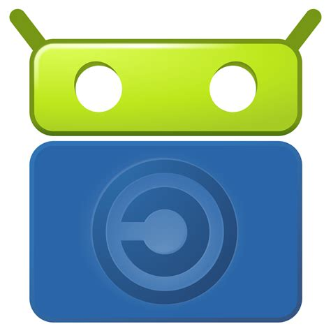

# F-Droid

https://f-droid.org/en/

## Summary

An installable catalogue of FOSS (Free and Open Source Software) applications for the Android platform.

## Why is this useful for offline or underserved communities?

## Basic Info

F-Droid is a robot with a passion for Free and Open Source Software (FOSS) on the Android platform. On this site you’ll find a repository of FOSS apps, along with an Android client to perform installations and updates, news, reviews, and other features covering all things Android and software-freedom related.

## Configuration

## Additional Resources

https://f-droid.org/en/docs/
