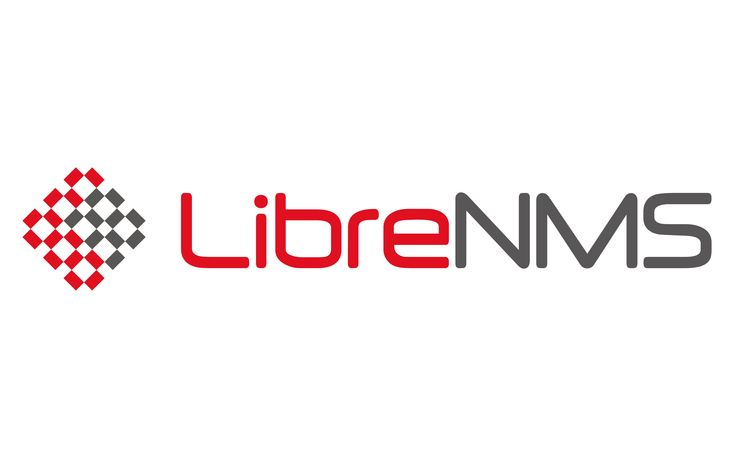

# LibreNMS

https://www.librenms.org/

A fully featured network monitoring system that provides a wealth of features and device support.

## Basic Info

Here's a brief list of supported features, some might be missing. 

    Auto discovery
    Alerting
    Multiple environment sensors support
    Multiple protocols data collection (STP, OSPF, BGP etc)
    VLAN, ARP and FDB table collection
    Customizable Dashboards
    Device Backup integration (Oxidized, RANCID)
    Distributed Polling
    Multiple Authentication Methods (MySQL, LDAP, Active Directory, HTTP)
    NetFlow, sFlow, IPFIX (NfSen)
    Service monitoring (Nagios Plugins)
    Syslog (Integrated, Graylog)
    Traffic Billing (Quota, 95th Percentile)
    Two Factor Authentication
    API
    Auto Updating

## Configuration

## Additional Resources

https://docs.librenms.org/

